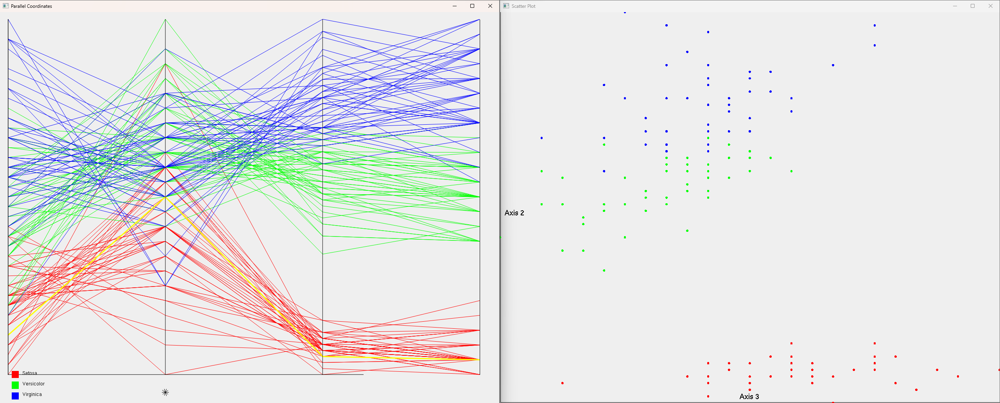

# CVis

Image of Wheat Seeds in Parallel Coordinates with Scatter Plot.

Renders CSV in Parallel Coordinates, handles large datasets. Allows for zoom, pan, stretch, and scale using keyboard, invert of attributes with mouse click.

Written in C using OpenGL and FreeGLUT.

Controls: controls: pan with wasd, scale x with qe, scale y with rf, invert with left click
